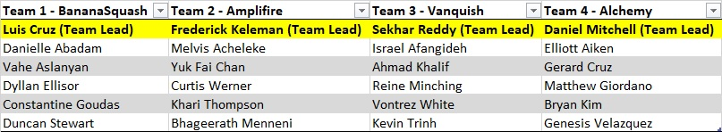

# Project 3

* E-Commerce - Revature Swag Shop
* Web Application URL (SSL Enabled) - https://revatureswag.shop

## Revature Staff

* Trainer - Benjamin Petruzziello - benjamin.petruzziello@revature.com
* COE - Andrew Shields - centerofexcellence@revature.com

## Point of Contact

* Scrum Master - Dyllan Ellisor
* Lead - Gerard Cruz

## Sub-Teams

* https://docs.google.com/document/d/1dHq1IMZnwZWowL-XmdtRnbzX1CtWxd5Ycb-caPOaT4w/edit

## Kanban Board

* https://trello.com/b/JQGiHYqT/ben-p-commerce-capstone-1385

## Requirements

* Git
* JDK 8
* Gradle
* NodeJS
* NPM
* Angular CLI
* Spring Tools Suite
* Lombok Plugin

## How To Run Application In Local Machine

* Follow the steps in [STARTUP.md](/STARTUP.md)